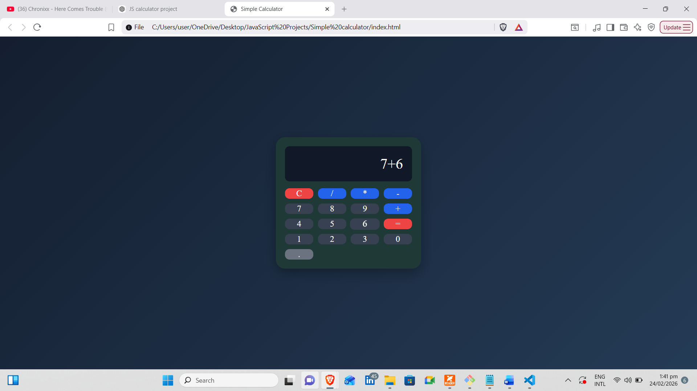

# Simple-calculator
A responsive and interactive calculator built using HTML, CSS, and Vanilla JavaScript. This project demonstrates DOM manipulation, event handling, state management, keyboard input, and basic error handling using eval() for expression evaluation. 

# Features 
- Perform basic arithmetic operations: addition (+), subtraction (-), manipulation(*), division(/)
- Decimal number support 
- Full keyboard support: 
   - Numbers operators (0-9, + , -, *, /)
   - Enter or = to calculate 
   - *Backspace* to delete last character
   - c to clear
- Clear button functionality 
- Error handling for invalid expression (prevents app crash)
- Simple, modern, and responsive UI. 

# Technologies Used 
- HTML5
- CSS3 (Flexbox & Grid)
- Vanilla JavaScript (ES6)

# Concepts Practiced 
- DOM selection (getElementById, querySelectorAll)
- Event handling (click & keyword)
- State management with currentInput variable 
- Conditional logic for button types (clear, equal, mumbers/operators)
- Error handling using try...catch
- Expression evaluation using eval() (safe in controlled environments)

# Preview 

# Purpose 
This project was built to reinforce JavaScript fundamentals and to practice connecting UI elements with funtional logic. 
It demonstrates safe use of eval() for controlled mathematical expressions and proper error handling for user input. 

# Author 
Frank D. Mwase 
Aspriring Full-Stacker developer| Passionate about building clean and funtional web applications. 